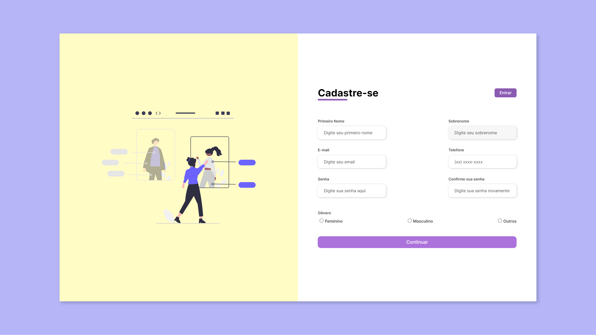

# Hi, I'm Gabriel! See my project below  👋

## Web Form Registration

Este projeto visa a prática de html e css básicos para a construção de sites.
Os principais tópicos abordados durante o desenvolvimento foram:

- Importar fontes externas.
- Usar css externo (⬆ Organização do código).
- Responsividade de tela.

### 🛠 Tecnologias Utilizadas

- Html
- Css
## Screenshots

[🔗 Clique aqui para acessar](https://gabrielvictorino8266.github.io/html_css_js/Registration_Form_Project/)
